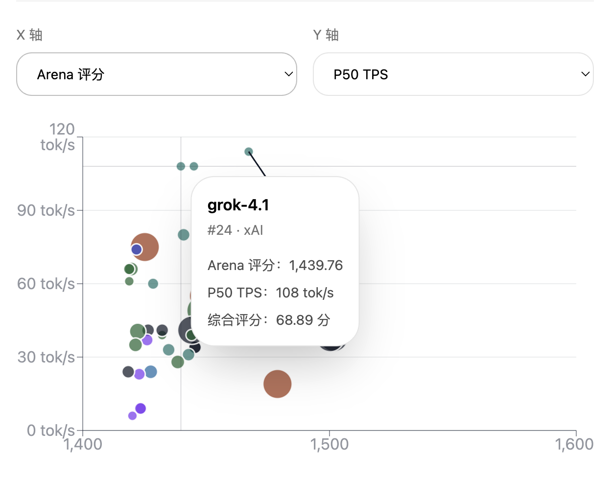

# LLM Arena 综合性能看板

把 LMArena 文本榜单、OpenRouter 价格和 OpenRouter endpoint latency/TPS 聚合到一个白底、苹果风格的对比站点里。

## 页面预览



## 本地运行

```bash
npm install
cp .env.example .env.local
npm run refresh:data
npm run dev
```

打开 `http://localhost:3000`。

## 关键脚本

- `npm run refresh:data`
  直接拉取 LMArena + OpenRouter，生成/覆盖 `data/runtime/snapshots/latest.json`
- `npm run dev`
  启动本地开发环境
- `npm run build`
  生产构建
- `npm run test`
  运行 Vitest 合同/单元/集成测试
- `npm run test:e2e`
  运行 Playwright 页面测试

## 环境变量

- `DEFAULT_LIMIT`
  首页默认展示的 TopN，默认 `50`
- `LEADERBOARD_SLUG`
  默认榜单口径，当前为 `overall-no-style-control`
- `REFRESH_TOKEN`
  `POST /api/refresh` 的手动刷新鉴权 token

## 数据流

1. `src/lib/arena/*` 抓取 `https://lmarena.ai/leaderboard/text/${LEADERBOARD_SLUG}` 并解析 `leaderboard.entries`
2. `src/lib/openrouter/*` 抓取 OpenRouter catalog 和 endpoint stats
3. `src/lib/matching/model-matcher.ts` 做模型对齐
4. `src/lib/snapshot/*` 生成本地快照
5. 首页和 `GET /api/data` 只读取本地快照

OpenAI 的 `gpt-5.*` 系列里，`high` 往往是推理强度配置，不等于 `pro` 这样的独立模型。
这类条目如果没有 OpenRouter 的明确同名模型，当前会保持未匹配，避免伪造 latency/TPS。

## 手动刷新

公开首页默认不显示刷新按钮。可以用以下方式触发刷新：

- 本地 CLI：`npm run refresh:data`
- 受保护 API：`POST /api/refresh`，并在请求头传 `x-refresh-token: <REFRESH_TOKEN>`

## 目录说明

- `src/app`
  App Router 页面与 API
- `src/components`
  可视化组件
- `src/lib`
  数据抓取、匹配、评分、快照与格式化
- `tests`
  合同 / 单元 / 集成 / E2E 测试
- `config/model-aliases.json`
  模型手工别名表
